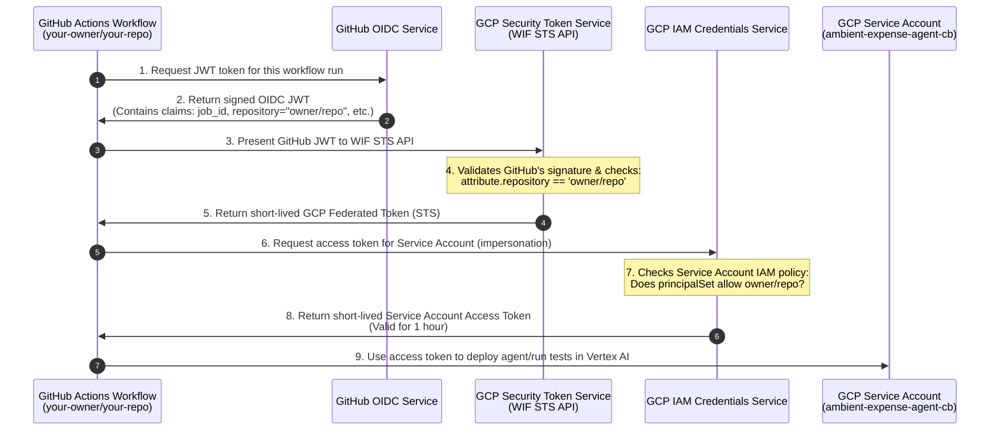

# Ambient Expense Agent

An event-driven ReAct agent built with the Google Agent Development Kit (ADK) that processes incoming expense claims, performs automated audits, and hooks up to a manager approval dashboard for human-in-the-loop decisions.

---

## 📐 Architecture Overview

This diagram represents the high-level event-driven topology of the system:


1. **Event Ingestion**: Raw expense report JSON payloads are published to Google Cloud Pub/Sub, which triggers the deployed Vertex AI Reasoning Engine agent through an OIDC-authenticated Push Subscription.
2. **Auto-Approval**: The agent audits the expense claims. Low-value expenses (< $100) are processed and approved instantly without human intervention.
3. **Human-in-the-Loop Interrupt**: High-value expenses (>= $100) or those raising security concerns trigger a human intervention pause (`RequestInput` event named `human_approval`), saving state to the session service.
4. **Manager Resolution**: A standalone FastAPI Manager Dashboard polls the session storage (either local SQLite or Cloud Vertex AI session service), displaying pending approvals, and sending resumption signals back to the Agent Runtime to resume execution.

---

## 📂 Project Structure

```text
ambient-expense-agent/
├── .github/workflows/         # Automated GitHub Actions pipelines
│   ├── deploy-to-prod.yaml    # Production deployment and review gate
│   ├── pr_checks.yaml         # Pull request testing & validation
│   ├── staging.yaml           # Staging build & deployment
│   └── teardown.yaml          # Automated infrastructure teardown
├── expense_agent/             # Core ReAct agent code
│   ├── app_utils/             # App utilities (telemetry, typing)
│   ├── agent.py               # Main agent logic (audit logic & state machine)
│   ├── agent_runtime_app.py   # Entry point for Agent Runtime deployment
│   ├── config.py              # Central agent configuration
│   └── fast_api_app.py        # Local API wrapping the agent
├── submission_frontend/       # Manager Dashboard service (FastAPI app, see [submission_frontend/README.md](file:///Volumes/Investor/Learning/Google%205-Day%20AI%20Agents%20Intensive%20Course/ambient-expense-agent/submission_frontend/README.md))
├── tests/                     # Unit, integration, and load tests
├── Dockerfile                 # Root level Dockerfile for multi-service deployment
├── GEMINI.md                  # AI-assisted development guide
├── Makefile                   # Automation shortcuts for local testing and deployment
├── pyproject.toml             # Root project dependencies & configuration
├── uv.lock                    # Dependency lockfile
└── agents-cli-manifest.yaml   # Manifest for google-agents-cli
```

> 💡 **Tip:** Use [Gemini CLI](https://github.com/google-gemini/gemini-cli) for AI-assisted development - project context is pre-configured in `GEMINI.md`.

---

## 📋 Requirements

### 1. Local Development Environment
* **Python**: `3.11` (>=3.11, <3.14 recommended)
* **uv**: Astral's package installer (used for all dependency management) - [Install](https://docs.astral.sh/uv/getting-started/installation/)
* **agents-cli**: Google Agent Development Kit CLI. Install via:
  ```bash
  uv tool install google-agents-cli
  ```
* **Google Cloud SDK (`gcloud`)**: Required for deployment, Pub/Sub provisioning, and IAM setup - [Install](https://cloud.google.com/sdk/docs/install)

### 2. Google Cloud Setup & Enabled APIs
To run or deploy resources on Google Cloud, ensure billing is enabled and activate the required services:
```bash
gcloud services enable \
  aiplatform.googleapis.com \
  run.googleapis.com \
  pubsub.googleapis.com \
  cloudbuild.googleapis.com
```

### 3. IAM Roles & Service Accounts
* **Vertex AI User (`roles/aiplatform.user`)**:
  * Required by the dashboard runtime service account (e.g. default Compute Service Account `<YOUR_PROJECT_NUMBER>-compute@developer.gserviceaccount.com`) to query user sessions and resume running agents.
  * Required by the `pubsub-invoker` service account to trigger agent executions via Vertex AI API.
* **Pub/Sub Publisher (`roles/pubsub.publisher`)**:
  * Required by the Pub/Sub system service agent (`service-<YOUR_PROJECT_NUMBER>@gcp-sa-pubsub.iam.gserviceaccount.com`) on the dead-letter topic to route failed events.

### 4. Configuration Variables (.env)
A set of environmental variables controls the behavior of both services. Create a `.env` file from the template:
```bash
cp .env.template .env
```
| Key | Purpose | Expected Value |
| --- | --- | --- |
| `SESSION_SERVICE_URI` | Configures storage backend. | `sqlite:///shared_sessions.db` (local) or `agentengine://` (Vertex AI cloud) |
| `AGENT_RUNTIME_ID` | Identifies reasoning engine resource. | `projects/<project_num>/locations/us-east1/reasoningEngines/<engine_id>` |
| `GOOGLE_CLOUD_PROJECT` | Active GCP project. | E.g. `gen-lang-client-0513235234` |
| `GOOGLE_CLOUD_LOCATION` | Vertex AI model location. | Set to `global` (needed for `gemini-3.1-flash-lite` regional availability) |

---

## 🚀 Quick Start

### 1. Install Dependencies
Initialize the virtual environment and fetch all packages:
```bash
uvx google-agents-cli setup
agents-cli install
```

### 2. Run Both Services Locally (Offline SQLite Mode)
Run the agent backend (port 8080) and manager dashboard (port 8081) concurrently, using a local SQLite database to persist sessions and test approvals end-to-end:
```bash
make run-all-local
```

### 3. Run Manager Dashboard Only (Toggled by Environment)
You can launch the dashboard independently, configured to read/write to a specific environment target:
* **Local SQLite mode**: `make fe-local`
* **Staging Cloud (Vertex AI)**: `make fe-staging`
* **Production Cloud (Vertex AI)**: `make fe-production`

### 4. Test the Reasoning Engine Individually
Launch the local agent playground to execute test prompts interactively:
```bash
agents-cli playground
```

---

## 🛠️ CLI Commands & Project Management

### General CLI Commands
| Command | Description |
| ------- | ----------- |
| `agents-cli install` | Installs project dependencies via `uv`. |
| `agents-cli playground` | Launches local interactive reasoning playground. |
| `agents-cli lint` | Performs style and syntax quality checks. |
| `agents-cli eval` | Runs the agent evaluation cycle (generate/grade/compare/analyze). |
| `uv run pytest tests/unit tests/integration` | Runs unit and integration test suites. |

### Lifecycle Infrastructure
| Command | Description |
| ------- | ----------- |
| `agents-cli scaffold enhance` | Adds deployment definitions and Terraform files to the project. |
| `agents-cli infra cicd` | Provisions GCP resources (WIF, buckets, IAM) and writes secrets to GitHub. |
| `agents-cli scaffold upgrade` | Upgrades core scaffolding dependencies to the latest version. |

---

## Development

Edit your agent logic in `expense_agent/agent.py` and test with `agents-cli playground` - it auto-reloads on save.

## Deployment

### Manual Deployment
To deploy the reasoning engine manually to Vertex AI Agent Runtime:
```bash
gcloud config set project <your-project-id>
agents-cli deploy
```

### CI/CD Deployment with GitHub Actions
This project is configured with an automated multi-environment CI/CD pipeline under `.github/workflows/` using Workload Identity Federation (WIF) and Terraform.

#### 1. Setup Infrastructure
To provision GCP IAM, Workload Identity Federation, telemetry datasets, log sinks, and automatically write GitHub Action secrets/variables:
```bash
agents-cli infra cicd \
  --cicd-runner github_actions \
  --staging-project <gcp-project-id> \
  --prod-project <gcp-project-id> \
  --region us-east1 \
  --repository-owner <github-owner> \
  --repository-name <github-repo> \
  --github-pat <your-github-pat> \
  --apply
```

#### 2. CI/CD Workflows
- **PR Checks (`pr_checks.yaml`)**: Triggered on pull requests to the `main` branch. Authenticates to Google Cloud via Workload Identity Federation, configures `GOOGLE_GENAI_USE_VERTEXAI` environment variables, and executes unit and integration tests.
- **Staging Pipeline (`staging.yaml`)**: Triggered on push or merge to the `main` branch.
  - Automatically builds and deploys the agent to the Staging environment on Vertex AI Agent Runtime.
  - Runs load/perf tests using Locust and exports results to the GCS bucket.
- **Production Pipeline (`deploy-to-prod.yaml`)**: Initiated immediately after the Staging pipeline succeeds.
  - Pauses for manual review/gate approval under GitHub Environment (`production`).
  - Deploys the agent to the Production environment on Vertex AI Agent Runtime.

#### 3. GitHub Secrets & Variables (Manual Reference)
If you need to configure your repository manually via the GitHub setting console, you must add the following under **Settings > Secrets and variables > Actions**:

##### Repository Secrets
* `WIF_POOL_ID`: The ID of the Workload Identity Pool created in GCP (e.g., `ambient-expense-agent-pool`).
* `WIF_PROVIDER_ID`: The ID of the OIDC Provider created in the pool (e.g., `ambient-expense-agent-oidc`).
* `GCP_SERVICE_ACCOUNT`: The email of the CI/CD runner service account that GitHub Actions will impersonate.

##### Repository Variables
* `GCP_PROJECT_NUMBER`: The numeric ID of the Google Cloud Project hosting the WIF pool.
* `CICD_PROJECT_ID`: The GCP Project ID hosting WIF and CI/CD operations.
* `STAGING_PROJECT_ID`: The GCP Project ID used for the Staging environment.
* `PROD_PROJECT_ID`: The GCP Project ID used for the Production environment.
* `REGION`: The default GCP region for Vertex AI Agent Runtime (e.g., `us-east1`).
* `APP_SERVICE_ACCOUNT_STAGING`: Service account email running the agent in Staging.
* `APP_SERVICE_ACCOUNT_PROD`: Service account email running the agent in Production.
* `LOGS_BUCKET_NAME_STAGING`: GCS bucket name where Staging log/telemetry artifacts are written.
* `LOGS_BUCKET_NAME_PROD`: GCS bucket name where Production log/telemetry artifacts are written.

> 💡 **How it is simplified:** The `agents-cli infra cicd` script automates this completely. It first provisions these GCP resources (WIF pool, providers, datasets, service accounts, and buckets) via Terraform, and then uses the GitHub API via your PAT token to write these 3 secrets and 9 variables automatically.

#### 4. Cleanup & Teardown (Undeploying Resources)
To avoid unnecessary charges and clean up unused resources, you can tear down both environments.

##### Option A: Automated Cleanup (Recommended)
You can trigger the teardown process directly from the GitHub Actions console:
1. Go to your GitHub repository and select the **Actions** tab.
2. Select **Teardown Infrastructure** in the left sidebar.
3. Click the **Run workflow** dropdown, and click the green **Run workflow** button.

This workflow will automatically:
- Discover and delete all deployed Vertex AI Reasoning Engines (`ambient-expense-agent`) in both your staging and production environments.
- Clean up all Pub/Sub topics, OIDC push subscriptions, invoker service accounts, and the deployed `expense-manager-dashboard` Cloud Run services.
- Run `terraform destroy` to tear down all WIF pools, providers, GCS buckets, service accounts, and logging sinks.

##### Option B: Manual Command Line Cleanup
If you prefer to perform the teardown manually in your local terminal:

1. **Clean up Pub/Sub and Dashboard Frontend resources**:
   ```bash
   make pubsub-cleanup PROJECT_ID=<YOUR_PROJECT_ID> REGION=us-east1
   ```

2. **Delete Vertex AI Reasoning Engines**:
   ```bash
   # Undeploy Staging Engine
   gcloud beta ai reasoning-engines delete <STAGE_ENGINE_ID> --project=<STAGE_PROJECT_ID> --region=us-east1 --quiet

   # Undeploy Production Engine
   gcloud beta ai reasoning-engines delete <PROD_ENGINE_ID> --project=<PROD_PROJECT_ID> --region=us-east1 --quiet
   ```

3. **Destroy Terraform Infrastructure**:
   Navigate to the `cicd` directory and run:
   ```bash
   cd deployment/terraform/cicd
   terraform destroy -var-file=vars/env.tfvars -auto-approve
   ```


#### 5. WIF Authentication Flow & Citations



##### References & Citations
* Official GitHub Action authentication guide: [google-github-actions/auth Github Repository](https://github.com/google-github-actions/auth)
* Official GCP authentication setup documentation: [GCP Workload Identity Federation with GitHub Actions Guide](https://cloud.google.com/iam/docs/workload-identity-federation-with-other-providers#github-actions)


## Event Ingestion Pipeline (Pub/Sub Setup)

The asynchronous event ingestion pipeline relies on Google Cloud Pub/Sub to deliver incoming expense events directly to the Agent Runtime:

1.  **Incoming Expense Reports Topic (`expense-reports`)**: Receives JSON payloads representing new expense claims.
2.  **Dead-Letter Topic (`expense-reports-dead-letter`)**: Captures messages that fail processing repeatedly so they are not lost.
3.  **OIDC-Authenticated Push Subscription (`expense-reports-push`)**: Delivers payloads directly to the Agent Runtime's `:streamQuery` REST endpoint. It runs in unwrapped payload mode (`--push-no-wrapper`) and retries up to 5 times before routing messages to the dead-letter topic.

### Automated Setup

The Pub/Sub pipeline is automatically provisioned during CI/CD deployments. To set up or update the pipeline resources manually, use the root Makefile shortcut:

```bash
make pubsub-setup PROJECT_ID=<YOUR_PROJECT_ID> REGION=us-east1 PROJECT_NUMBER=<YOUR_PROJECT_NUMBER>
```

### Manual Setup Commands


To create the topics, service account, permissions, and push subscription in your GCP project, run the following `gcloud` commands in your terminal:

```bash
# 1. Create the dead-letter topic
gcloud pubsub topics create expense-reports-dead-letter --project=<YOUR_PROJECT_ID>

# 2. Create the main incoming topic
gcloud pubsub topics create expense-reports --project=<YOUR_PROJECT_ID>

# 3. Create the pubsub-invoker service account
gcloud iam service-accounts create pubsub-invoker \
  --description="Service account for Pub/Sub push authentication" \
  --display-name="Pub/Sub Invoker Service Account" \
  --project=<YOUR_PROJECT_ID>

# 4. Grant the Vertex AI User role to the service account
gcloud projects add-iam-policy-binding <YOUR_PROJECT_ID> \
  --member="serviceAccount:pubsub-invoker@<YOUR_PROJECT_ID>.iam.gserviceaccount.com" \
  --role="roles/aiplatform.user"

# 5. Grant publisher permissions to the Pub/Sub service agent on the dead-letter topic
gcloud pubsub topics add-iam-policy-binding expense-reports-dead-letter \
  --member="serviceAccount:service-<YOUR_PROJECT_NUMBER>@gcp-sa-pubsub.iam.gserviceaccount.com" \
  --role="roles/pubsub.publisher" \
  --project=<YOUR_PROJECT_ID>

# 6. Create the OIDC push subscription delivering directly to the reasoning engine
gcloud pubsub subscriptions create expense-reports-push \
  --topic=expense-reports \
  --push-endpoint="https://us-east1-aiplatform.googleapis.com/v1/projects/<YOUR_PROJECT_ID>/locations/us-east1/reasoningEngines/<YOUR_REASONING_ENGINE_ID>:streamQuery" \
  --push-no-wrapper \
  --push-auth-service-account="pubsub-invoker@<YOUR_PROJECT_ID>.iam.gserviceaccount.com" \
  --push-auth-token-audience="https://us-east1-aiplatform.googleapis.com/v1/projects/<YOUR_PROJECT_ID>/locations/us-east1/reasoningEngines/<YOUR_REASONING_ENGINE_ID>:streamQuery" \
  --ack-deadline=600 \
  --dead-letter-topic=expense-reports-dead-letter \
  --max-delivery-attempts=5 \
  --project=<YOUR_PROJECT_ID>
```

## Observability

Built-in telemetry exports to Cloud Trace, BigQuery, and Cloud Logging.

