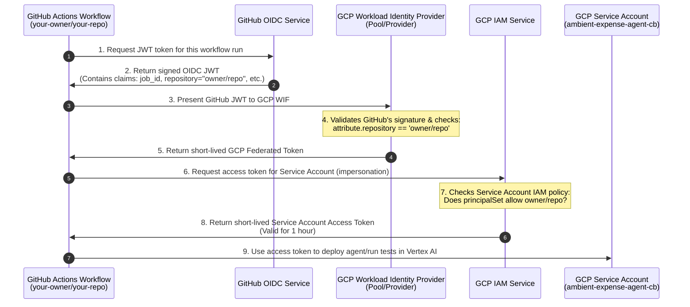

# ambient-expense-agent

Simple ReAct agent
Agent generated with `agents-cli` version `0.5.0`

## Project Structure

```
ambient-expense-agent/
├── app/         # Core agent code
│   ├── agent.py               # Main agent logic
│   └── app_utils/             # App utilities and helpers
├── tests/                     # Unit, integration, and load tests
├── GEMINI.md                  # AI-assisted development guide
└── pyproject.toml             # Project dependencies
```

> 💡 **Tip:** Use [Gemini CLI](https://github.com/google-gemini/gemini-cli) for AI-assisted development - project context is pre-configured in `GEMINI.md`.

## Requirements

Before you begin, ensure you have:
- **uv**: Python package manager (used for all dependency management in this project) - [Install](https://docs.astral.sh/uv/getting-started/installation/) ([add packages](https://docs.astral.sh/uv/concepts/dependencies/) with `uv add <package>`)
- **agents-cli**: Agents CLI - Install with `uv tool install google-agents-cli`
- **Google Cloud SDK**: For GCP services - [Install](https://cloud.google.com/sdk/docs/install)


## Quick Start

Install `agents-cli` and its skills if not already installed:

```bash
uvx google-agents-cli setup
```

Install required packages:

```bash
agents-cli install
```

Test the agent with a local web server:

```bash
agents-cli playground
```

You can also use features from the [ADK](https://adk.dev/) CLI with `uv run adk`.

## Commands

| Command              | Description                                                                                 |
| -------------------- | ------------------------------------------------------------------------------------------- |
| `agents-cli install` | Install dependencies using uv                                                         |
| `agents-cli playground` | Launch local development environment                                                  |
| `agents-cli lint`    | Run code quality checks                                                               |
| `agents-cli eval`    | Evaluate agent behavior (generate, grade, analyze, and more — see `agents-cli eval --help`) |
| `uv run pytest tests/unit tests/integration` | Run unit and integration tests                                                        |

## 🛠️ Project Management

| Command | What It Does |
|---------|--------------|
| `agents-cli scaffold enhance` | Add CI/CD pipelines and Terraform infrastructure |
| `agents-cli infra cicd` | One-command setup of entire CI/CD pipeline + infrastructure |
| `agents-cli scaffold upgrade` | Auto-upgrade to latest version while preserving customizations |

---

## Development

Edit your agent logic in `app/agent.py` and test with `agents-cli playground` - it auto-reloads on save.

## Deployment

### Manual Deployment
To deploy the reasoning engine manually to Vertex AI Agent Runtime:
```bash
gcloud config set project <your-project-id>
agents-cli deploy
```

### CI/CD Deployment with GitHub Actions
This project is configured with an automated multi-environment CI/CD pipeline under `.github/workflows/` using Workload Identity Federation (WIF) and Terraform.

#### 1. Setup Infrastructure
To provision GCP IAM, Workload Identity Federation, telemetry datasets, log sinks, and automatically write GitHub Action secrets/variables:
```bash
agents-cli infra cicd \
  --cicd-runner github_actions \
  --staging-project <gcp-project-id> \
  --prod-project <gcp-project-id> \
  --region us-east1 \
  --repository-owner <github-owner> \
  --repository-name <github-repo> \
  --github-pat <your-github-pat> \
  --apply
```

#### 2. CI/CD Workflows
- **PR Checks (`pr_checks.yaml`)**: Triggered on pull requests to the `main` branch. Authenticates to Google Cloud via Workload Identity Federation, configures `GOOGLE_GENAI_USE_VERTEXAI` environment variables, and executes unit and integration tests.
- **Staging Pipeline (`staging.yaml`)**: Triggered on push or merge to the `main` branch.
  - Automatically builds and deploys the agent to the Staging environment on Vertex AI Agent Runtime.
  - Runs load/perf tests using Locust and exports results to the GCS bucket.
- **Production Pipeline (`deploy-to-prod.yaml`)**: Initiated immediately after the Staging pipeline succeeds.
  - Pauses for manual review/gate approval under GitHub Environment (`production`).
  - Deploys the agent to the Production environment on Vertex AI Agent Runtime.

#### 3. GitHub Secrets & Variables (Manual Reference)
If you need to configure your repository manually via the GitHub setting console, you must add the following under **Settings > Secrets and variables > Actions**:

##### Repository Secrets
* `WIF_POOL_ID`: The ID of the Workload Identity Pool created in GCP (e.g., `ambient-expense-agent-pool`).
* `WIF_PROVIDER_ID`: The ID of the OIDC Provider created in the pool (e.g., `ambient-expense-agent-oidc`).
* `GCP_SERVICE_ACCOUNT`: The email of the CI/CD runner service account that GitHub Actions will impersonate.

##### Repository Variables
* `GCP_PROJECT_NUMBER`: The numeric ID of the Google Cloud Project hosting the WIF pool.
* `CICD_PROJECT_ID`: The GCP Project ID hosting WIF and CI/CD operations.
* `STAGING_PROJECT_ID`: The GCP Project ID used for the Staging environment.
* `PROD_PROJECT_ID`: The GCP Project ID used for the Production environment.
* `REGION`: The default GCP region for Vertex AI Agent Runtime (e.g., `us-east1`).
* `APP_SERVICE_ACCOUNT_STAGING`: Service account email running the agent in Staging.
* `APP_SERVICE_ACCOUNT_PROD`: Service account email running the agent in Production.
* `LOGS_BUCKET_NAME_STAGING`: GCS bucket name where Staging log/telemetry artifacts are written.
* `LOGS_BUCKET_NAME_PROD`: GCS bucket name where Production log/telemetry artifacts are written.

> 💡 **How it is simplified:** The `agents-cli infra cicd` script automates this completely. It first provisions these GCP resources (WIF pool, providers, datasets, service accounts, and buckets) via Terraform, and then uses the GitHub API via your PAT token to write these 3 secrets and 9 variables automatically.

#### 4. WIF Authentication Flow & Citations



##### References & Citations
* Official GitHub Action authentication guide: [google-github-actions/auth Github Repository](https://github.com/google-github-actions/auth)
* Official GCP authentication setup documentation: [GCP Workload Identity Federation with GitHub Actions Guide](https://cloud.google.com/iam/docs/workload-identity-federation-with-other-providers#github-actions)


## Observability

Built-in telemetry exports to Cloud Trace, BigQuery, and Cloud Logging.
