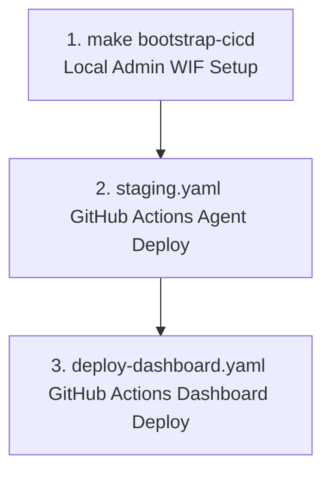
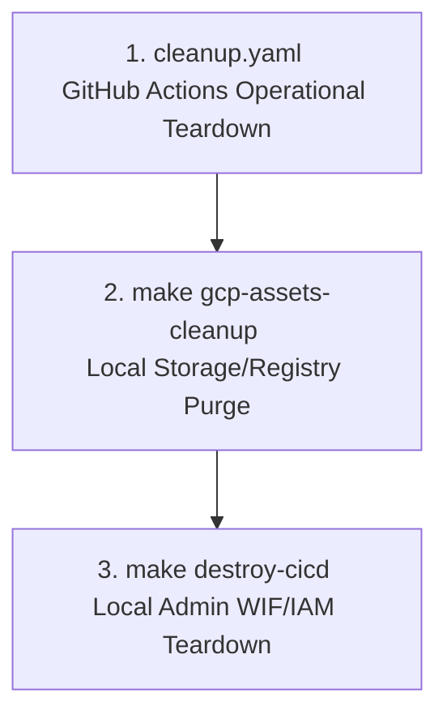

# Deployment & Operations Guide

This guide documents the command-line interfaces, multi-environment deployment steps, IAM configurations, and Pub/Sub settings used in the Ambient Expense Agent project.

---

## 🛠️ CLI Commands & Project Management

### General CLI Commands
| Command | Description |
| ------- | ----------- |
| `agents-cli install` | Installs project dependencies via `uv`. |
| `agents-cli playground` | Launches the local interactive reasoning playground UI. |
| `agents-cli lint` | Performs style, format, and syntax quality checks. |
| `agents-cli eval` | Runs the agent evaluation cycle (generate/grade/compare/analyze). |
| `uv run pytest tests/unit tests/integration` | Runs unit and integration test suites. |

### Lifecycle Infrastructure
| Command | Description |
| ------- | ----------- |
| `agents-cli scaffold enhance` | Adds deployment definitions and Terraform files to the project. |
| `agents-cli infra cicd` | Provisions GCP resources (WIF, buckets, IAM) and writes secrets to GitHub. |
| `agents-cli scaffold upgrade` | Upgrades core scaffolding dependencies to the latest version. |

---

## 🚀 Deployment

### 1. Manual Deployment
To deploy the reasoning engine manually to Vertex AI Agent Runtime:
```bash
gcloud config set project <your-project-id>
agents-cli deploy
```

---

### 2. CI/CD Deployment with GitHub Actions
This project is configured with an automated multi-environment CI/CD pipeline under `.github/workflows/` using Workload Identity Federation (WIF) and Terraform.

#### A. Setup Infrastructure
To provision GCP IAM, Workload Identity Federation, telemetry datasets, log sinks, and automatically write GitHub Action secrets/variables:
```bash
agents-cli infra cicd \
  --cicd-runner github_actions \
  --staging-project <gcp-project-id> \
  --prod-project <gcp-project-id> \
  --region us-east1 \
  --repository-owner <github-owner> \
  --repository-name <github-repo> \
  --github-pat <your-github-pat> \
  --apply
```

#### B. CI/CD Workflows
*   **PR Checks (`pr_checks.yaml`)**: Triggered on pull requests to the `main` branch. Authenticates to Google Cloud via WIF and executes unit and integration tests.
*   **Staging Pipeline (`staging.yaml`)**: Triggered on push or merge to the `main` branch.
    *   Automatically builds and deploys the agent to the Staging environment on Vertex AI Agent Runtime.
    *   Runs load/perf tests using Locust and exports results to the GCS bucket.
*   **Production Pipeline (`deploy-to-prod.yaml`)**: Initiated immediately after the Staging pipeline succeeds.
    *   Pauses for manual review/gate approval under GitHub Environment (`production`).
    *   Deploys the agent to the Production environment on Vertex AI Agent Runtime.
*   **Dashboard Pipeline (`deploy-dashboard.yaml`)**: Triggered automatically on changes to the `submission_frontend/` directory or manually. Builds the Manager Dashboard container, uploads it to Artifact Registry, deploys it to Cloud Run, and wires the Pub/Sub push subscription to the reasoning engine.
*   **Teardown Pipeline (`cleanup.yaml`)**: Triggered manually from the GitHub Actions console. Undeploys Vertex AI Reasoning Engines, deletes the `expense-manager-dashboard` Cloud Run service, and tears down Pub/Sub ingestion lines (topics and push subscriptions) in the selected environment.


#### C. GitHub Secrets & Variables Reference
If you need to configure your repository manually, add the following under **Settings > Secrets and variables > Actions**:

##### Repository Secrets
*   `WIF_POOL_ID`: The ID of the Workload Identity Pool created in GCP.
*   `WIF_PROVIDER_ID`: The ID of the OIDC Provider created in the pool.
*   `GCP_SERVICE_ACCOUNT`: The email of the CI/CD runner service account that GitHub Actions will impersonate.

##### Repository Variables
*   `GCP_PROJECT_NUMBER`: The numeric ID of the Google Cloud Project hosting the WIF pool.
*   `CICD_PROJECT_ID`: The GCP Project ID hosting WIF and CI/CD operations.
*   `STAGING_PROJECT_ID`: The GCP Project ID used for the Staging environment.
*   `PROD_PROJECT_ID`: The GCP Project ID used for the Production environment.
*   `REGION`: The default GCP region for Vertex AI Agent Runtime (e.g., `us-east1`).
*   `APP_SERVICE_ACCOUNT_STAGING`: Service account email running the agent in Staging.
*   `APP_SERVICE_ACCOUNT_PROD`: Service account email running the agent in Production.
*   `LOGS_BUCKET_NAME_STAGING`: GCS bucket name where Staging log/telemetry artifacts are written.
*   `LOGS_BUCKET_NAME_PROD`: GCS bucket name where Production log/telemetry artifacts are written.

---

### 3. Cleanup & Teardown (Undeploying Resources)
To avoid unnecessary charges and clean up unused resources, you can tear down both environments.

#### Option A: Automated Cleanup (Recommended)
Trigger the teardown process directly from the GitHub Actions console:
1.  Go to your GitHub repository and select the **Actions** tab.
2.  Select **Teardown Infrastructure** in the left sidebar.
3.  Click the **Run workflow** dropdown, and click the green **Run workflow** button.

This workflow will automatically:
*   Discover and delete all deployed Vertex AI Reasoning Engines in both environments.
*   Clean up all Pub/Sub topics, OIDC push subscriptions, and the deployed `expense-manager-dashboard` Cloud Run services.
*   *(Note: For security reasons, the automated pipeline does not delete GCS buckets or core WIF/IAM pools. You must purge these locally).*

#### Option B: Manual Command Line Cleanup
If you prefer to perform the teardown manually in your local terminal:

1.  **Clean up Pub/Sub and Dashboard Frontend resources**:
    ```bash
    make pubsub-cleanup PROJECT_ID=<YOUR_PROJECT_ID> REGION=us-east1
    ```
2.  **Delete GCS Storage Buckets & Artifact Registry repositories**:
    ```bash
    make gcp-assets-cleanup PROJECT_ID=<YOUR_PROJECT_ID> REGION=us-east1
    ```
3.  **Destroy Terraform IAM & WIF Infrastructure**:
    ```bash
    make destroy-cicd
    ```

---

### 4. Env Deployment & Teardown Lifecycle Order

Always follow this exact sequence to prevent dependency lockouts:

#### A. Deployment Progression


#### B. Teardown Progression

> [!IMPORTANT]
> Running `cleanup.yaml` on GitHub Actions **must** happen before running `make destroy-cicd`. If you destroy the WIF pool first, the GitHub runner will immediately lose its OIDC credentials and fail to execute the cleanup workflow.

---

### 5. WIF Authentication Flow

For a detailed diagram and walkthrough of the Workload Identity Federation (WIF) authentication flow and sequence of token exchanges, refer to [WIF Authentication Flow in GCP Deployment Architecture](gcp_deployment_architecture.md#1-authentication-oidc-wif).


---

## 📥 Event Ingestion Pipeline (Pub/Sub Setup)

The asynchronous event ingestion pipeline relies on Google Cloud Pub/Sub to deliver incoming expense events directly to the Agent Runtime:

1.  **Incoming Expense Reports Topic (`expense-reports`)**: Receives JSON payloads representing new expense claims.
2.  **Dead-Letter Topic (`expense-reports-dead-letter`)**: Captures messages that fail processing repeatedly so they are not lost.
3.  **OIDC-Authenticated Push Subscription (`expense-reports-push`)**: Delivers payloads directly to the Agent Runtime's `:streamQuery` REST endpoint. It runs in unwrapped payload mode (`--push-no-wrapper`) and retries up to 5 times before routing messages to the dead-letter topic.

### Manual Setup Commands
To create the topics, service account, permissions, and push subscription in your GCP project manually, run the following `gcloud` commands:

```bash
# 1. Create the dead-letter topic
gcloud pubsub topics create expense-reports-dead-letter --project=<YOUR_PROJECT_ID>

# 2. Create the main incoming topic
gcloud pubsub topics create expense-reports --project=<YOUR_PROJECT_ID>

# 3. Create the pubsub-invoker service account
gcloud iam service-accounts create pubsub-invoker \
  --description="Service account for Pub/Sub push authentication" \
  --display-name="Pub/Sub Invoker Service Account" \
  --project=<YOUR_PROJECT_ID>

# 4. Grant the Vertex AI User role to the service account
gcloud projects add-iam-policy-binding <YOUR_PROJECT_ID> \
  --member="serviceAccount:pubsub-invoker@<YOUR_PROJECT_ID>.iam.gserviceaccount.com" \
  --role="roles/aiplatform.user"

# 5. Grant publisher permissions to the Pub/Sub service agent on the dead-letter topic
gcloud pubsub topics add-iam-policy-binding expense-reports-dead-letter \
  --member="serviceAccount:service-<YOUR_PROJECT_NUMBER>@gcp-sa-pubsub.iam.gserviceaccount.com" \
  --role="roles/pubsub.publisher" \
  --project=<YOUR_PROJECT_ID>

# 6. Create the OIDC push subscription delivering directly to the reasoning engine
gcloud pubsub subscriptions create expense-reports-push \
  --topic=expense-reports \
  --push-endpoint="https://us-east1-aiplatform.googleapis.com/v1/projects/<YOUR_PROJECT_ID>/locations/us-east1/reasoningEngines/<YOUR_REASONING_ENGINE_ID>:streamQuery" \
  --push-no-wrapper \
  --push-auth-service-account="pubsub-invoker@<YOUR_PROJECT_ID>.iam.gserviceaccount.com" \
  --push-auth-token-audience="https://us-east1-aiplatform.googleapis.com/v1/projects/<YOUR_PROJECT_ID>/locations/us-east1/reasoningEngines/<YOUR_REASONING_ENGINE_ID>:streamQuery" \
  --ack-deadline=600 \
  --dead-letter-topic=expense-reports-dead-letter \
  --max-delivery-attempts=5 \
  --project=<YOUR_PROJECT_ID>
```
