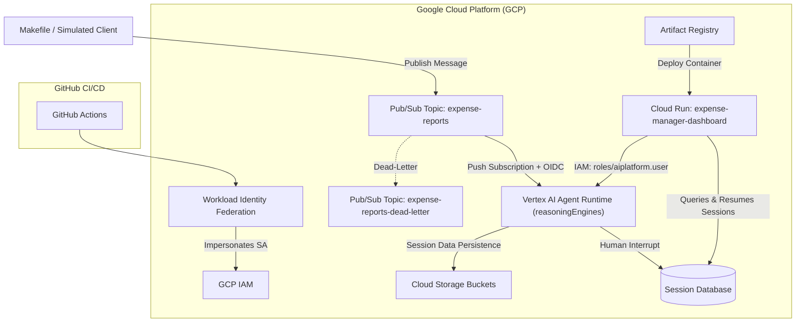
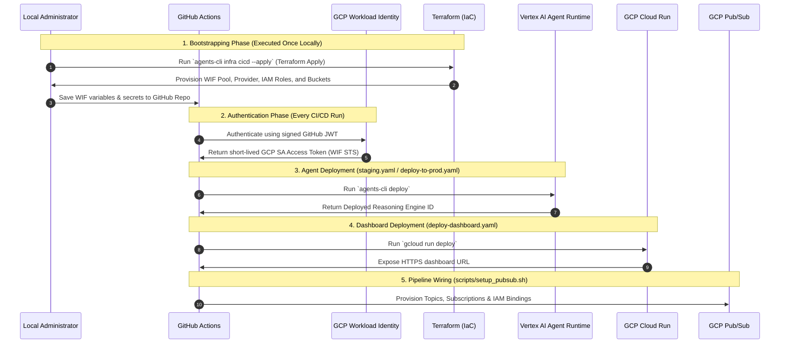
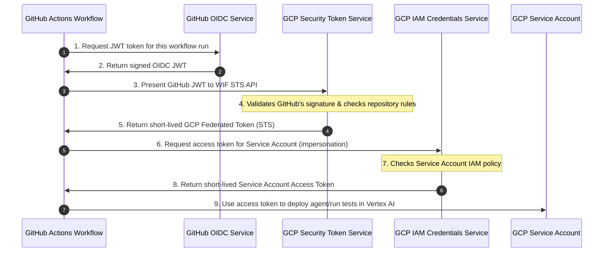

# GCP Deployment & Architecture Guide for AWS Solutions Architects

This guide maps the deployment workflow, CI/CD pipelines, and cloud resources in the **Ambient Expense Agent** repository to **AWS (Amazon Web Services)** equivalents, explaining how GCP provisions each component to fulfill our architecture: 

---

## 🗺️ GCP to AWS Service Mapping

| GCP Service | AWS Equivalent | Role in this Project |
| :--- | :--- | :--- |
| **Vertex AI Reasoning Engines** (Agent Runtime) | **AWS Lambda** + **Amazon Bedrock Agents** / SageMaker Pipelines | Runs the Python ReAct agent in a serverless environment with pre-built support for LLM orchestration, sessions, and tool calling. |
| **Cloud Run** | **AWS Fargate** (on Amazon ECS) | Deploys the FastAPI Manager Dashboard container. It is a serverless container hosting service that scales down to zero. |
| **Cloud Pub/Sub** | **Amazon SNS** / **Amazon SQS** | Ingests expense report events asynchronously and pushes them to the Agent Runtime using an OIDC push subscription. |
| **Cloud Storage (GCS)** | **Amazon S3** | Stores evaluation traces, load test results (Locust logs), and Terraform state files. |
| **Workload Identity Federation (WIF)** | **AWS IAM Roles Anywhere** / AWS OIDC Identity Provider | Authenticates GitHub Actions runners to GCP using short-lived tokens, eliminating long-lived credentials. |
| **Cloud Build** | **AWS CodeBuild** | Builds Docker containers for Cloud Run under-the-hood. |
| **IAM Policy Bindings** | **AWS IAM Policies / Role Bindings** | Defines which roles (e.g. `roles/aiplatform.user`) are bound to specific service accounts. |

---

## 🏗️ Architecture & Provisioning Flows

The system architecture consists of two primary applications: the **Logical ReAct Agent** and the **Manager Approval Dashboard**, linked together by an **Event-Driven Ingestion Pipeline**.

### 1. The ReAct Agent (Vertex AI Reasoning Engines)
*   **What it is**: The core logic written in python (`expense_agent/`) is deployed as a **Vertex AI Reasoning Engine** (also known as the Agent Runtime).
*   **Provisioning**: Deployed via `agents-cli deploy`. GCP provisions this in a Google-managed tenant project. It exposes standard REST endpoints for query execution:
    *   `:streamQuery` (streaming endpoint used by our Pub/Sub push subscription).
    *   `:query` (standard synchronous endpoint).
*   **Storage & State Persistence**: Session histories and active execution trees are tracked natively by the Vertex AI Agent Runtime framework. Behind the scenes, logs and run metrics are piped to Google Cloud Storage (GCS) and BigQuery.

### 2. The Dashboard Frontend (Google Cloud Run)
*   **What it is**: The manager approval UI is a FastAPI application (`submission_frontend/`) packaged as a Docker container.
*   **Provisioning**: Deployed via `gcloud run deploy`. GCP builds the container image locally/on Cloud Build and registers it in **Artifact Registry** (equivalent to Amazon ECR). It then provisions a serverless **Cloud Run** container.
*   **Parameters**:
    *   `--memory=1Gi`: Required to accommodate large Google GenAI Python dependencies during startup.
    *   `--allow-unauthenticated`: Exposes a public HTTPS ingress endpoint.
*   **Inter-service IAM**: The Cloud Run runtime service account is granted the `roles/aiplatform.user` policy binding on the GCP project. This authorizes the dashboard to query active Vertex AI sessions and post resumption payloads.

### 3. Asynchronous Event Ingestion (Cloud Pub/Sub)
*   **What it is**: Decouples incoming messages from the agent processing pipeline.
*   **Provisioning**: Automatically provisioned by the `scripts/setup_pubsub.sh` script:
    1.  **Topics**: Creates `expense-reports` (primary queue) and `expense-reports-dead-letter` (DLQ).
    2.  **Service Account (`pubsub-invoker`)**: Acts as the calling identity. It is granted the `roles/aiplatform.user` role.
    3.  **Push Subscription**: Binds `expense-reports-push` to forward incoming payloads directly to the Reasoning Engine's `:streamQuery` API. It uses OIDC authentication (impersonating `pubsub-invoker`) to sign requests with a bearer token, guaranteeing that only authorized messages trigger the agent.

---

## 🚀 The CI/CD Pipeline Flow

The GitHub Actions workflows automate the provisioning and deployment phases using infrastructure-as-code and environment gates.

### 1. Authentication (OIDC WIF)
Instead of storing permanent GCP JSON keys in GitHub secrets, the pipelines utilize OIDC:
1.  GitHub issues a unique, cryptographic JWT token for each workflow run.
2.  The `google-github-actions/auth` step presents this token to GCP's **Workload Identity Federation (WIF)**.
3.  WIF validates the GitHub signature, verifies that the repository matches the configured pool, and returns a short-lived (1-hour) Google Cloud access token.

### 2. Infrastructure as Code (Terraform)
Located in `deployment/terraform/`, Terraform acts as the base provisioning layer for WIF, IAM policies, GCS Buckets, and BigQuery datasets:
*   `apis.tf`: Activates Google APIs (`aiplatform`, `run`, `pubsub`, `iam`).
*   `wif.tf`: Provisions the identity pool and configures OIDC mappings.
*   `storage.tf`: Sets up storage buckets for audit traces and logs.
*   `telemetry.tf`: Provisions BigQuery datasets for runtime performance monitoring.

> [!IMPORTANT]
> **Local Bootstrapping Security Rule**: To enforce the **Privilege Escalation Prevention** guardrail, the base Terraform plan (which sets up WIF and IAM policy bindings) is strictly run from a **local administrative terminal** (using `agents-cli infra cicd --apply`). Running it inside the operational deployment pipeline would require granting the GitHub Actions runner permissions to alter security policies and IAM roles—introducing a major security vulnerability. This local approach also resolves the "chicken-and-egg" bootstrap problem where the pipeline cannot authenticate via WIF until WIF itself is provisioned.

### 3. Deployment Pipelines
*   **Staging (`staging.yaml`)**:
    *   Triggered on push/merge to the `main` branch.
    *   Deploys the ReAct agent logic to Vertex AI.
    *   Automatically triggers `scripts/setup_pubsub.sh` to wire the Pub/Sub topics to the new reasoning engine.
*   **Production (`deploy-to-prod.yaml`)**:
    *   Pauses after staging success, requiring manual gate approval.
    *   Deploys the agent logic to the Production Vertex AI environment.
    *   Re-wires the production Pub/Sub topics to the newly deployed engine ID.
*   **Dashboard (`deploy-dashboard.yaml`)**:
    *   Triggered when files inside `submission_frontend/` change.
    *   Deploys the containerized FastAPI UI to Google Cloud Run.

### 4. Teardown & Teardown (`cleanup.yaml`)
To prevent running costs, the `Teardown Infrastructure` workflow is triggered manually:
1.  Discovers and undeploys all active `ambient-expense-agent` Reasoning Engines.
2.  Invokes `make pubsub-cleanup` to delete the `expense-manager-dashboard` Cloud Run service, `expense-reports` topics, subscription, and invoker IAM configurations.
3.  Runs `terraform destroy` to tear down the foundational storage buckets, logging, and WIF bindings.

---

## 🔒 The Security Guardrail: Privilege Escalation Prevention

To enforce secure DevOps practices on Google Cloud, the CI/CD pipeline is designed with strict privilege boundaries to prevent **Privilege Escalation** (e.g., preventing a compromised runner from modifying its own IAM permissions).

### 1. Separation of Duties (IAM vs. Deployment)
*   **The Guardrail**: The CI/CD runner service account (`ambient-expense-agent-cb`) is granted only deployment-specific roles (e.g., `roles/run.admin`, `roles/aiplatform.user`, `roles/artifactregistry.writer`, `roles/cloudbuild.builds.editor`) rather than project-level Security Admin (`roles/resourcemanager.projectIamAdmin`) or Owner roles.
*   **The Rationale**: This prevents the pipeline from modifying IAM policies or enabling sensitive APIs. If an attacker injects malicious code into a pull request to alter workflow steps, they cannot leverage the runner's credentials to elevate their privileges or grant project ownership to external accounts.

### 2. Bootstrapping vs. Deploying
*   **Administrative Phase (Local)**: High-privilege setup actions, such as WIF setup, IAM assignments, and bucket creation, are executed once by a human administrator running `agents-cli infra cicd --apply` (or manual `gcloud` commands) from their authorized local terminal.
*   **Operational Phase (Runner)**: The pipeline only executes the pre-authorized deployment steps using the limited service account runner.

### 3. Industry Security Standards & Citations
*   **Google Cloud Security Foundations Blueprint**:
    > *"To reduce the risk of privilege escalation, you do not grant the CI/CD deployment service account permissions to modify security policies, IAM bindings (`iam.serviceAccounts.setIamPolicy`), or enable sensitive APIs. The deployment pipeline is restricted to deploying application infrastructure..."*
    > — [Google Cloud Security Foundations Blueprint - Infrastructure Deployment](https://cloud.google.com/architecture/security-foundations/infrastructure-deployment)
*   **OWASP Top 10 CI/CD Security Risks (CICD-SEC-04: Poisoned Pipeline Execution)**:
    > *"Poisoned Pipeline Execution occurs when an attacker with access to a source code repository... is able to execute commands inside the build environment. If the build environment's runner has administrative IAM access or the ability to modify permissions, the attacker can leverage the runner's identity to escalate privileges and compromise the entire cloud account."*
    > — [OWASP Top 10 CI/CD Security Risks](https://owasp.org/www-project-cicd-security/assets/pdf/OWASP_Top_10_CI-CD_Security_Risks.pdf)

